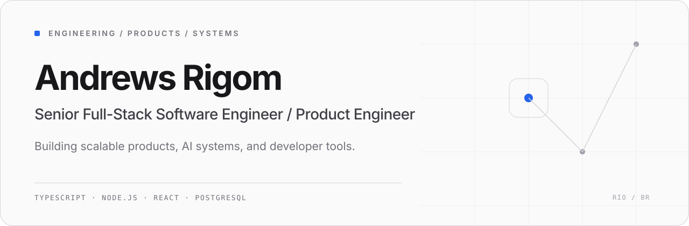

<picture>
  <source media="(prefers-color-scheme: dark)" srcset="./assets/profile-hero-dark.svg">
  <source media="(prefers-color-scheme: light)" srcset="./assets/profile-hero-light.svg">
  
</picture>

[Website](https://seusaas.com) · [Portfolio](https://andrewsrigom.pages.dev) · [LinkedIn](https://www.linkedin.com/in/andrewsrigom/) · [GitHub](https://github.com/andrewsrigom)

## About

I’m a Senior Full-Stack Software Engineer with 10+ years of experience building and maintaining production systems across fintech, e-commerce, and SaaS. I work across the stack, with a strong focus on frontend architecture, product engineering, APIs, data, and the workflows that keep software reliable in production.

Today I’m building SaaS products and investing more deeply in backend systems, AI infrastructure, distributed architectures, and developer tooling.

## Current focus

- **Agentic engineering** — local-first tools, retrieval systems, MCP integrations, and verifiable agent workflows.
- **Backend and distributed systems** — service boundaries, data ownership, failure recovery, observability, and operational evidence.
- **SaaS architecture** — multi-tenant foundations, durable product workflows, and maintainable systems that can evolve.

## Selected work

### [CodebaseScan](https://github.com/andrewsrigom/codebasescan)

Local-first static auditing for Node.js, React, and Next.js repositories, with offline audit modes, immutable reports, and CI policy gates.

`TypeScript` · `Node.js` · `Next.js` · `Static analysis`

### [VaultMind](https://github.com/andrewsrigom/vaultmind)

Self-hosted knowledge system that unifies GitHub, Notion, Google Drive, and local documents into cited answers over a PostgreSQL and pgvector index.

`Next.js` · `PostgreSQL` · `pgvector` · `RAG` · `MCP`

### [Aster](https://github.com/andrewsrigom/aster-streaming-platform)

Production-oriented video-on-demand platform with rights-aware cataloging, federated APIs, accessible playback, failure recovery, and observable Docker-based journeys.

`TypeScript` · `GraphQL` · `PostgreSQL` · `Redis` · `Docker`

### [Caderno UI](https://github.com/andrewsrigom/caderno-ui)

Framework-agnostic, notebook-inspired component system built with Web Components, plus dedicated React and Astro adapters.

`TypeScript` · `Web Components` · `Lit` · `React` · `Astro`

### [Career Ledger](https://github.com/andrewsrigom/career-ledger)

Private-first system that turns reviewed engineering evidence into a sanitized, bilingual static portfolio through an explicit publication boundary.

`TypeScript` · `Node.js` · `Astro` · `Playwright` · `Cloudflare Pages`

## Technology

| Area | Working set |
| --- | --- |
| **Core engineering** | `TypeScript` · `JavaScript` · `Node.js` |
| **Frontend** | `React` · `Next.js` · `Web Components` · `Tailwind CSS` |
| **Backend and data** | `PostgreSQL` · `pgvector` · `Redis` · `GraphQL` |
| **Systems and infrastructure** | `Docker` · `GitHub Actions` · `Playwright` |
| **AI systems** | `RAG` · `MCP` · `LangGraph` |

## Connect

[LinkedIn](https://www.linkedin.com/in/andrewsrigom/) · [Website](https://seusaas.com) · [Portfolio](https://andrewsrigom.pages.dev) · [Email](mailto:andrews.ribeiro.gomes@gmail.com)
